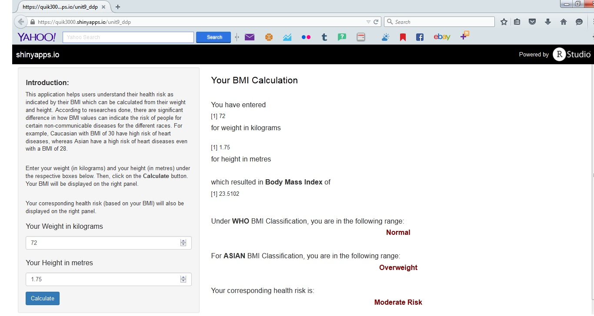

Risk Category by BMI for Caucasian & Asian
========================================================
**Understand Your Health Risk via Your BMI Calculation**
<br/>
<br/>
<br/>
<br/>
<br/>
<br/>
<br/>
<br/>
<small>Presented by: quik3000
<br/>
</small>


Introduction
========================================================
This application helps users understand their health risk as indicated by their BMI which can be calculated from their weight and height. 

According to researches done, there are significant difference in how BMI values can indicate the risk of people for certain non-communicable diseases for different races. For example, Caucasian with BMI of 30 have high risk of heart diseases, whereas Asian with BMI of 28 is already considered as having a high risk of heart diseases (especially South Asian).

This is due to increased fat accumulation even with low BMI in Asian.


Algorithm for BMI Calculation
========================================================

x = weight in kilograms; y = height in metres.

Hence, the BMI is calculated as follows:

**bmi <- x / y^2**

For example, if a user weighs 72 kg and is 1.75 m tall:


```r
x <- 72
y <- 1.75
bmi <- x / y^2
bmi
```

```
[1] 23.5102
```


Screen Shot
========================================================




Reference
========================================================
For more details on BMI classification for Asians, please refer to the following URL:

http://protectyourhealthtips.blogspot.sg/2013/04/bmi-body-mass-index-classification-for.html

For health risk classification, please refer to the following PDF publication:

http://www.who.int/nutrition/publications/bmi_asia_strategies.pdf
